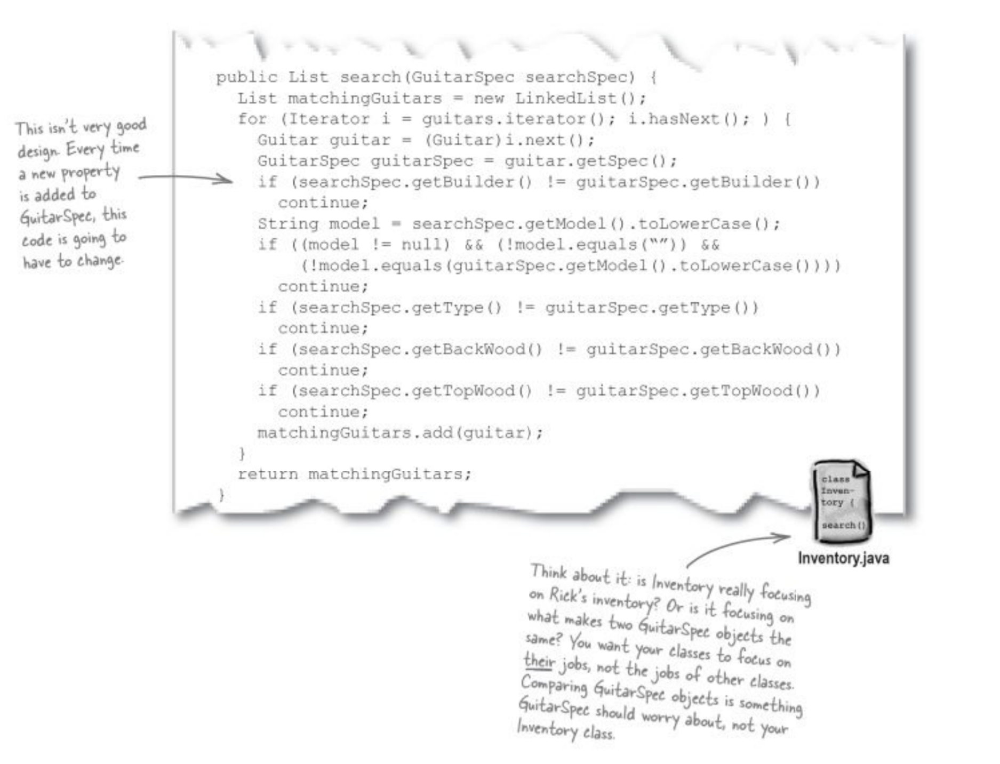
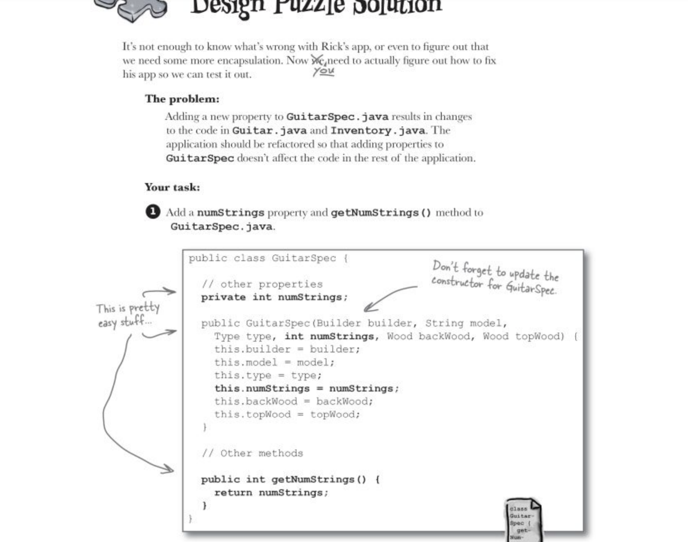

# Chapter 1- Well designed apps

## How to use iterator

```java
public Guitar getGuitar(String id){
    for(Iterator i=guitarList.iterator(); guitarList.hasNextt();){
        Guitar g=i.next();
        if(g.getId().equals(id)){
            return g;
        }      
    }
    return null;
}
```

## Three steps to write greate softwares
Stage 1. Make sure your software does what the customer wants it to do-> make the code more robust(meaning less fragile)
Stage 2. Apply basic OO principles to add flexibility to get rid of duplicated code
Stage 3. Strive for a maintainable reusable design by using design patterns

## Stage 1- Ditching String comparisons
Even though we can use a function like *toLowerCase()* to avoid problems with uppercase and lowercase letters. But lets get rid of String comparison altogether.

Solution: use enums

````java
public enum Wood{
    INDIAN_ROSEWOOD, ALDER;

    public String toString{
        switch(this){
            case INDIAN_ROSEWOOD:
            return "Indian wood";
            case ALDER:
            return "Alder";
        }
    }

}

````
then use the enum instead of string values so when we compare searchGuitar and guitart from the guitrts list, we don't need to call toLowerCase() method or consider case sensitivity: 
````java
new Guitart(Builder.FENDER, Wood.ALDER);

````

## Stage 1- key workd "continue"
```java
public Guitar search(Guitart searchGuitar){
    for(Iterator i=guitarts.iterator(), i.hasNext();){
        Guitar guitar=i.next();
        if(searchGuitar.getBuilder() !=guitart.getBuilder())
        continue;
        if(searchGuitart.getModel() !=guitart.getModel())
        continue;
        if(searchGuitart.getWood() !=guitar.getWood())
        continue;
        return guitar;
    }
 return null;
}
```

## Stage 2- Change mismatched object type- look for problems especially related to duplicated code or bad class/object design

1. An object should be what their name suggests
2. Each object should represent a single concept
3. Unused properties are a dead giveaway, if you have got an object that is being used with no-value or null properties often, you have probably got an object doing more that one job. for example, a customer search for a Guitar will not provide the guitar's ID meaning that the searched object is not a Guitar object, rather a Guitar spec object.

How to do the seperation?
solution: encapsulating the the common properties share by Guitar and Guitar spec to the new object GuitarSpecs. encapsulating can help seperate the generic properties of Guitar from the actual Guitar object itself and then the Guitar just have a variable pointing to a new objecz type that stores all its properties

Why encapsulating?-> avoid duplicated code!! keey the parts of code that stay the same seperate from the parts of code that changes then it is really to make change to your code without breaking anything.


**Principle** : Any time you see duplicated code, look for places to encapsulate!
The idea behind encapsulation is to protect information in one part of your application form the other parts of your application. When you break the bahavior out from a class, you can change the behavior without the class having to change as well. so if you changed how properties were stored, you wouldn't have to change your Guitar class at all, because the properties are encapsulated from Guitar.


## Stage 3- Strive for maintainable reusable design
Now, what if we need to add NumStrings of Guitar in the Guitar object? The GuitarSpec and Iventory class both will need to change. 


What id delegate? Delegation is when an object needs to perform a certain task, and instead of doing that task directly, it asks another object to handle the task. So we want the search() method in Inventory to ask GuitarSpec to tell if two Guitar specs are equal, instead of comparing the two GuitarSpec objects directly within the search() method itself. search() delegates the comparison to GuitarSpec.

Delegation makes your code more reusable. It also lets each object worry about its own functionality, rather than spreading the code that handles a single object's behavior all throughout your application.





Refactored code:



