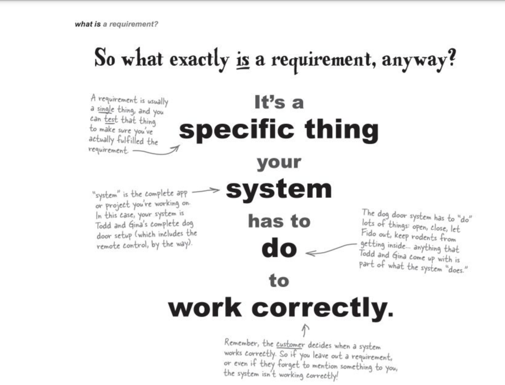
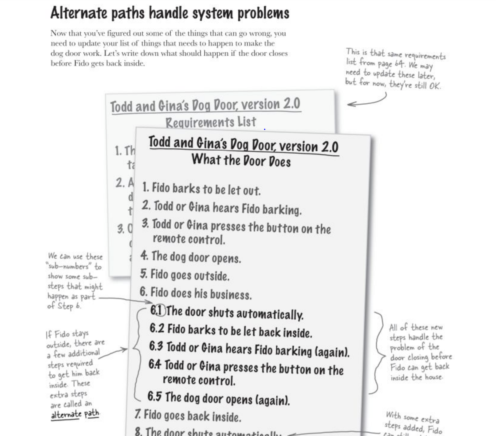
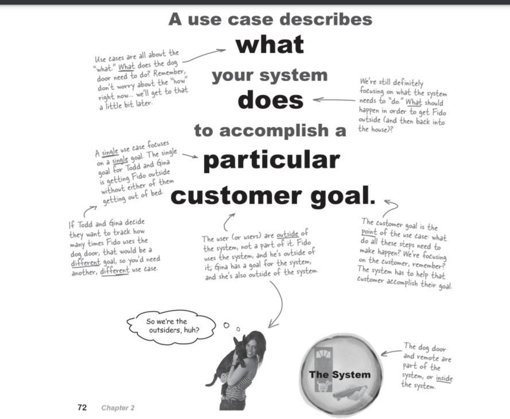
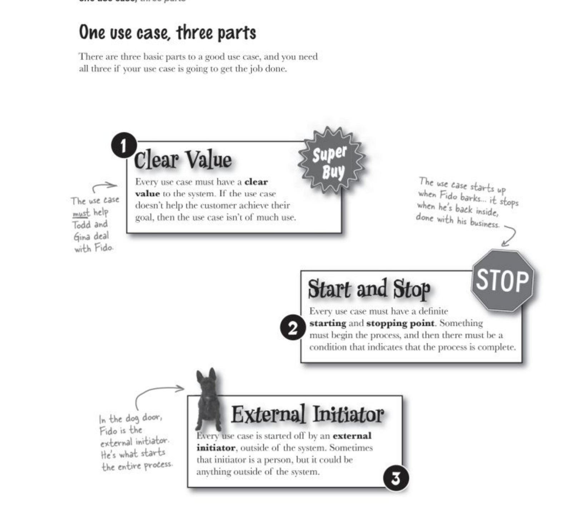
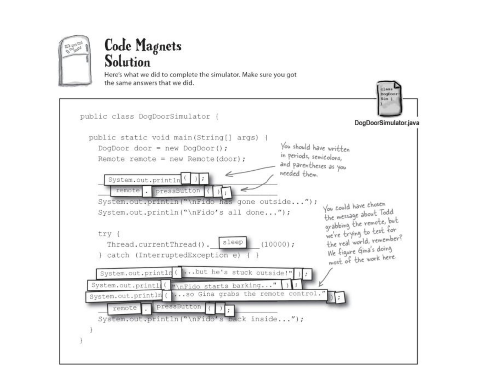
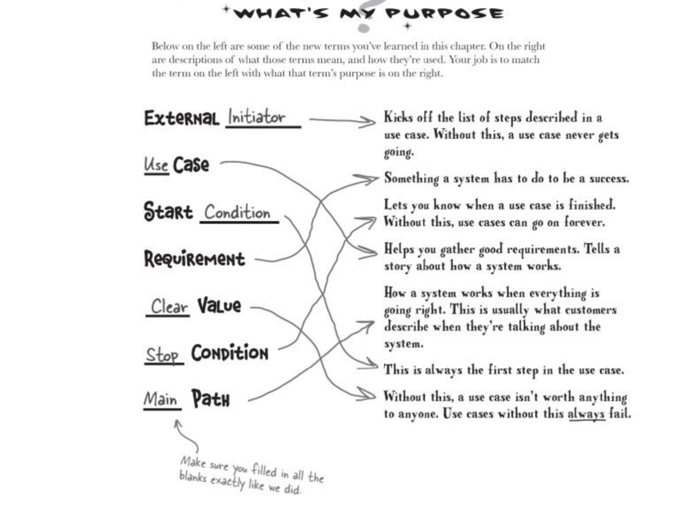
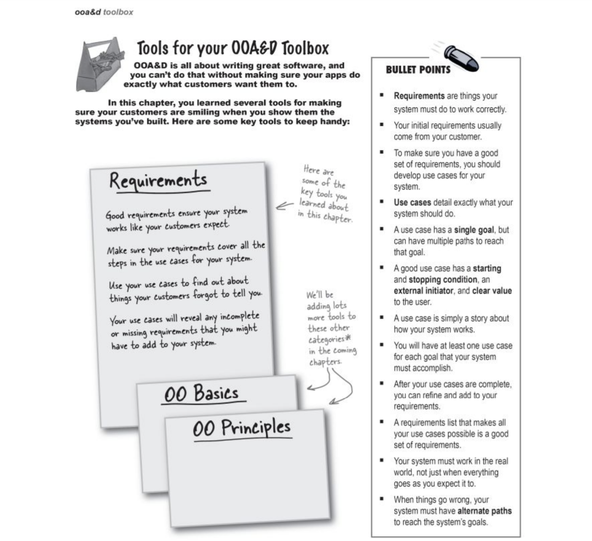

# Gathering requirements

## The steps
1. Make sure your software does what the customer wants it to do

The best way to get good requirements is to understand what a system is supposed to do

A requirment is also more that just what the customer wants- although that is a good place to start. Most peeple expect things continue to work even if problem occurs. So you have to anticipate what is going to go wrong and add requirements to take care of those problems as well. A good set of requirements goes beyound just what your customer tell you and makes sure that the system works even in unusual or unexpected circumstances.

One of the keyx points about a user case is that it us focused on accomplishing one particular goal. If your system does more than 1 thing then you will need more than one uer case.
User cases are mean ti help you understand what a sytem should do- and often to explain the systemto others(like customer or your boss). if your user case focuses on specific code level details. It is not going to be useful to anyone but a programmer. so your user case should use simple, general daily language.

2. Thread for alternative path- plan when things goes wrong

3. Summerize the terminology

