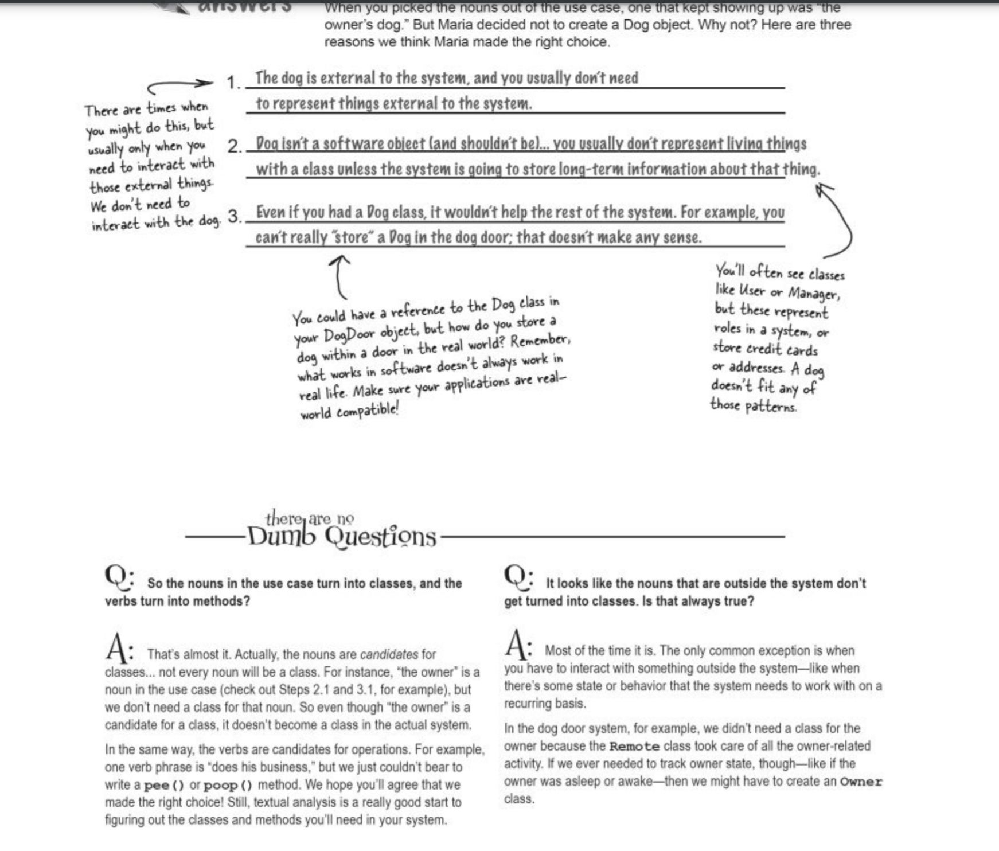

# Take your software to the real world

1. Realize you might need a second user case

2. Understand Delegation and the Power of loosley coupled design

Delegation shields your objects from implementation changes to other objects in your software-Loose Couple

3. Pay attention to the nouns in your user case
The nous in a user case are usually the classes yu need to write and focous on in your system.
Looking at the nouns(and verbs) in your use case to figure out classes and methods is called textual analysis.

Atually the focus in on Dog not Bark:

4. Understand UML

