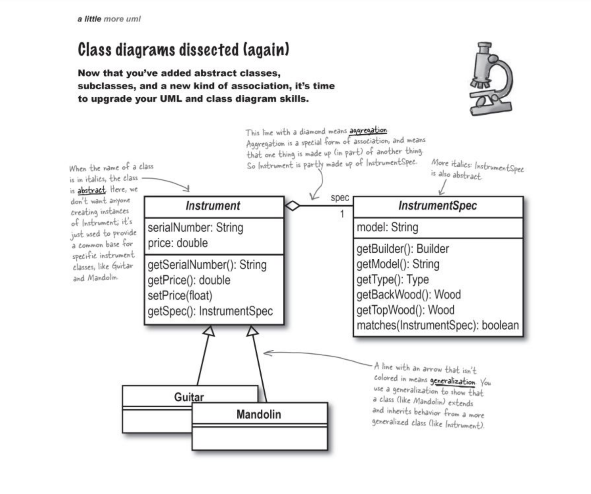
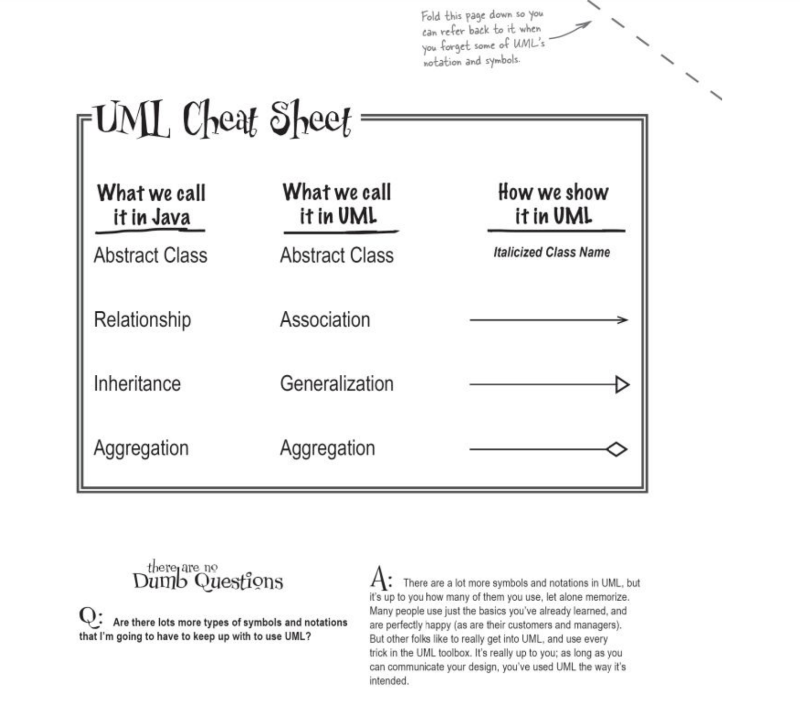
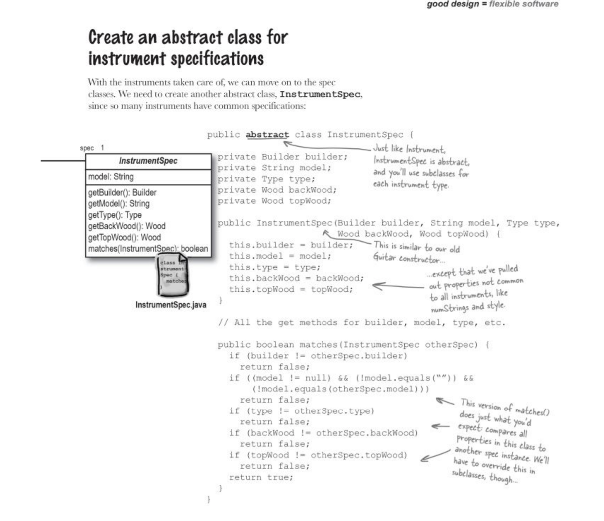
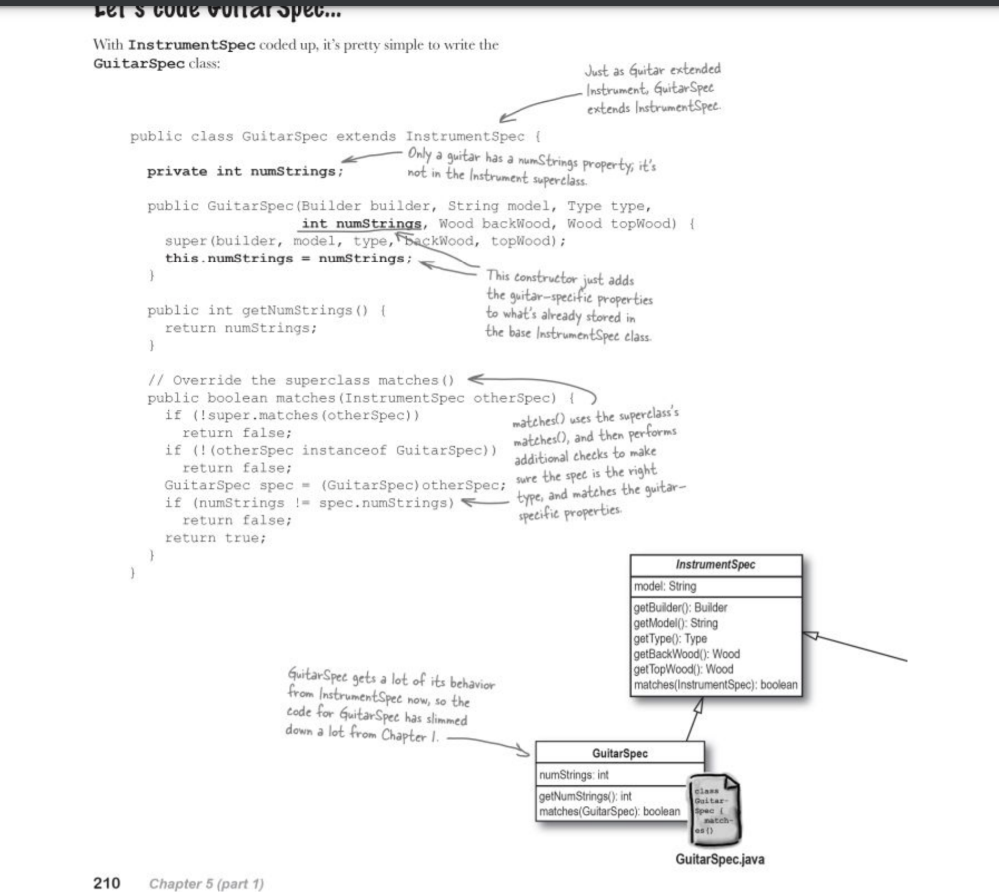
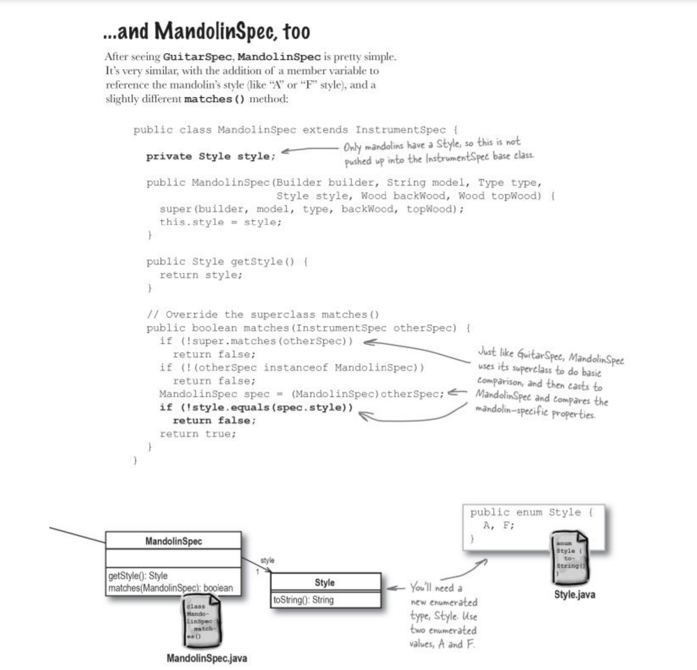
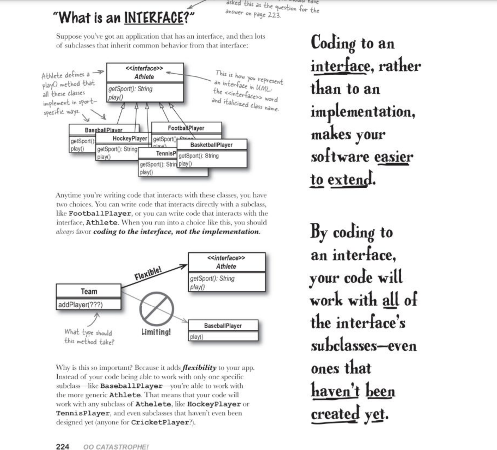
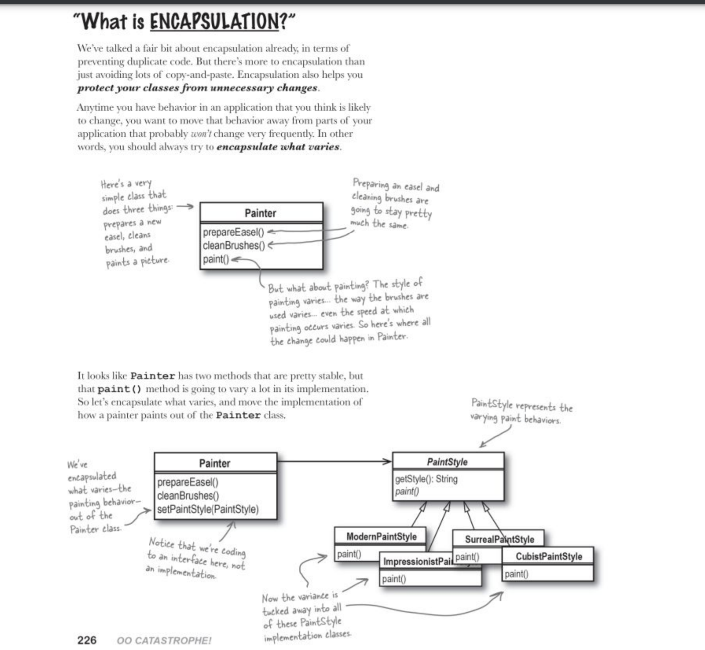
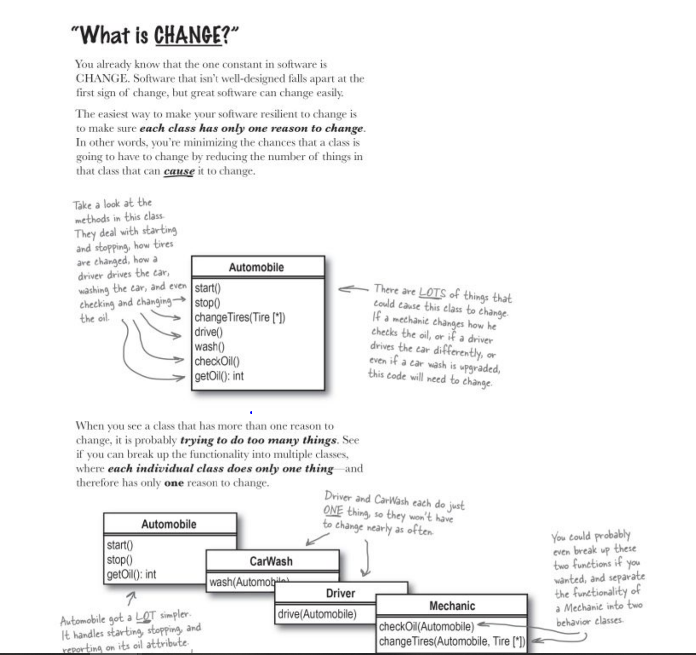

# Good Design=flexible software

## Abstract classes
Abstract classes are placeholders for actual implementtaion classes. The abstract class defines behavior, and the subclasses implement that behavior.
Whenever you find common behavior in two or more places, look to abstract that behavior into a class and then reuse that bahevior in the common classes.

## Use superclasses method, then performs additional checks in own implementation

SubClass, pay attention to the matches() and understand how it sues super:

## Interface
Coding to an interface, rather than to an implementaion makes your software easier to extend. By coding to an interface, your code will work with all the interface's subclasses-even ones that haven't been created yet.
Interface: has the dual role of defining behavior that applies to multiple types, and also being the preferred focus of classes that use those types.

## Encapulation
Responsible for preventing more maintenance problems than any other OO principle in history, by localizing the changes required for the behavior of an object to vary.

## Change
Every class should attempt to make sure that it has only one reason to this, the death of many badly designed piece of software

## In summary:
OO principles: Encapsulate what varies. Code to an interface rather than to an implementation. Each class in your application should have only one reason to change.

